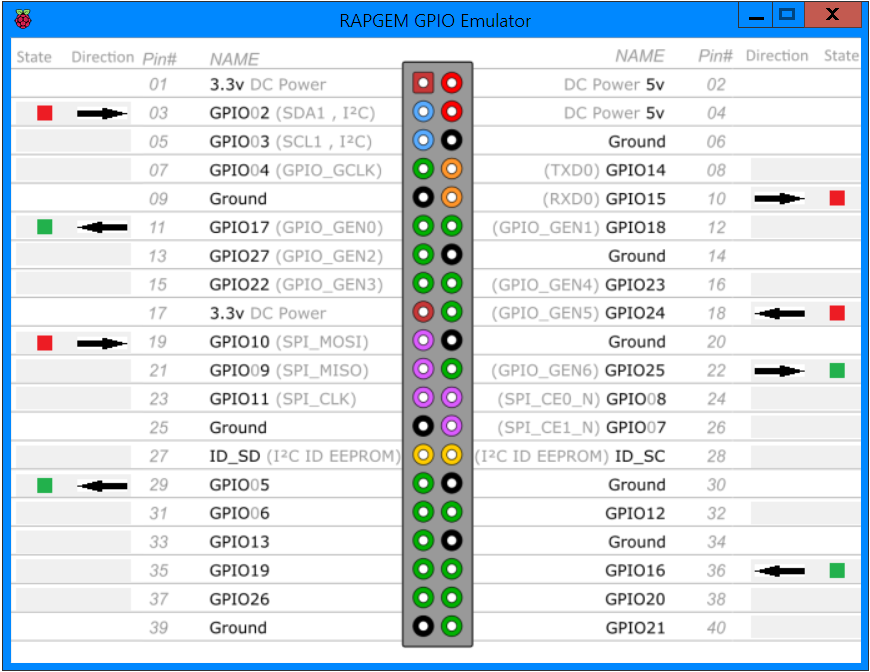
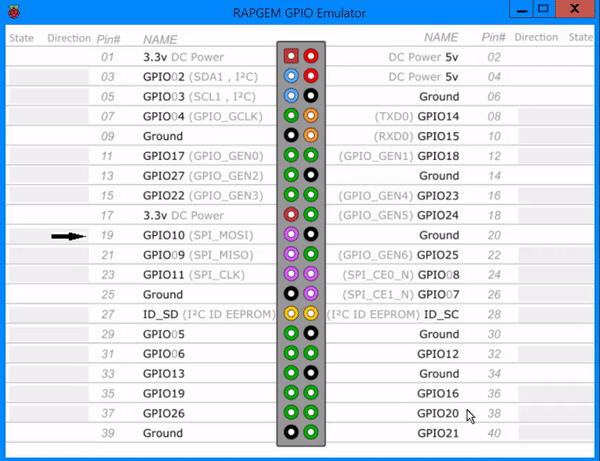

# RAPGEM

## The RAspberry Pi Gpio EMulator


## Write Raspberry Pi python code on any windows machine!
The RAPGEM will work on any windows machine with .NET framework 3.5 or higher

## RPi.py system-wide installation:
* Find out the python `site-packages` directory by running this in the python shell:
	```python
	from sys import path
	path
	```
* Move/Copy the RPi.py file into the `site-packages` directory
## Using RAPGEM
RAPGEM will show each pin's status (`direction` and `state`)<br>
If the pin's `direction` is `GPIO.IN` then clicking on the state or direction cell in pin's row will toggle its `state`

## API
The RAPGEM RPi.py file has the same commands as the original RPi.py on the Raspberry Pi

#### Import module:
```python
from RPi import GPIO
```

#### Set pin numbering:
```python
GPIO.setmode(GPIO.BCM or GPIO.BOARD)
```

#### Set pin direction:
```python
GPIO.setup(GPIO.OUT or GPIO.IN)
```

#### Set pin value (if pin direction is `GPIO.OUT`):
```python
GPIO.output(pinNumber, GPIO.HIGH or GPIO.LOW)
```

#### Get pin value (if pin direction is `GPIO.IN`):
```python
GPIO.input(pinNumber)
#returns GPIO.HIGH or GPIO.LOW
```

#### Cleanup (resets all pins):
```python
GPIO.cleanup()
```
